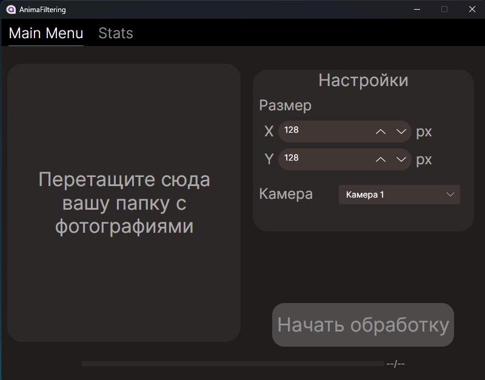
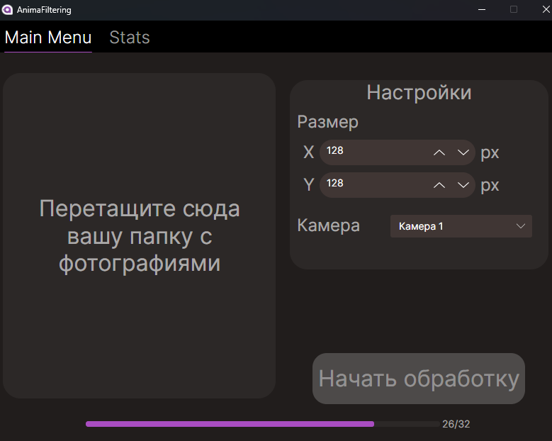
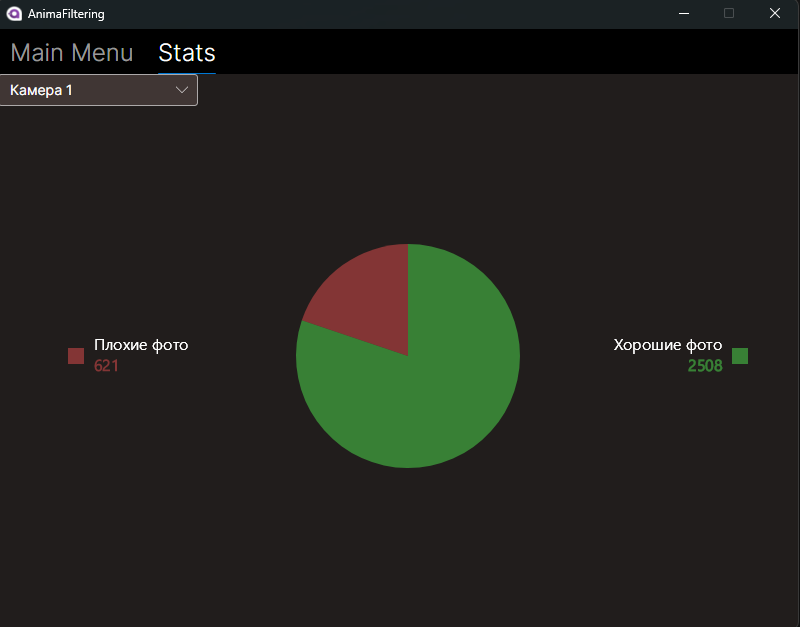

# Animals Filtration

Animals Filtration – это Desktop-приложение, которое осуществляет фильтрацию качественных изображений с животными и генерирует CSV отчёты о найденных на изображениях животных.

## Установка

Приложение полностью автономное и включает в себя среду выполнения. Для запуска выполните следующие шаги:

1. Скачайте архив со страницы [релизов](https://github.com/MIDIFrogs/AnimalsFiltration/releases).
2. Распакуйте архив.
3. Запустите EXE файл.

## Использование

Приложение является десктопным, и управление осуществляется через графический интерфейс (GUI). Принцип использования следующий:

1. Запустите приложение.
2. Перетащите папку с изображениями в рабочую область.
3. Настройте параметры для фильтрации.
4. Запустите фильтрацию.

## Скриншоты

### Главное меню

### Демонстрация работы приложения

### Страница статистики

## Лицензия

Данный проект лицензирован под [AGPLv3.0](LICENSE).